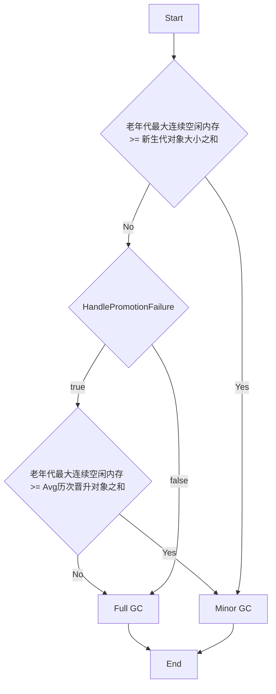

```mermaid
graph TD 
A[Start] --> B{老年代最大连续空闲内存 >= 新生代对象大小之和}; 
B -->|No| C{HandlePromotionFailure};
C -->|true| D{老年代最大连续空闲内存 >= Avg历次晋升对象之和};
D -->|Yes| E[Minor GC]; 
D -->|No| F[Full GC];
C -->|false| F;
B -->|Yes| E;
F --> G[End];
E --> G;
```

