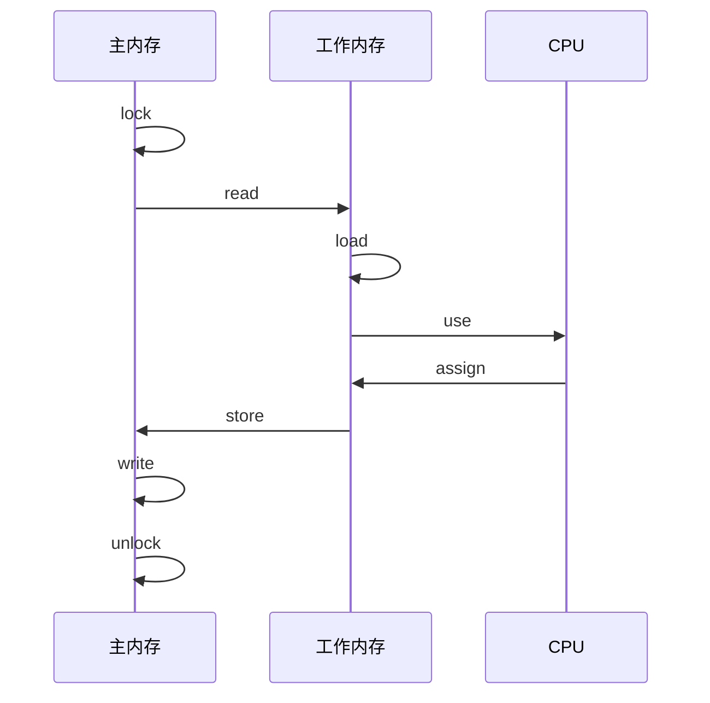

```mermaid
sequenceDiagram
	participant 主内存
	participant 工作内存
	participant CPU
	
	主内存->>主内存: lock
	主内存->>工作内存: read
	工作内存->>工作内存: load
	工作内存->>CPU: use
	CPU->>工作内存: assign
	工作内存->>主内存: store
	主内存->>主内存: write
	主内存->>主内存: unlock
```